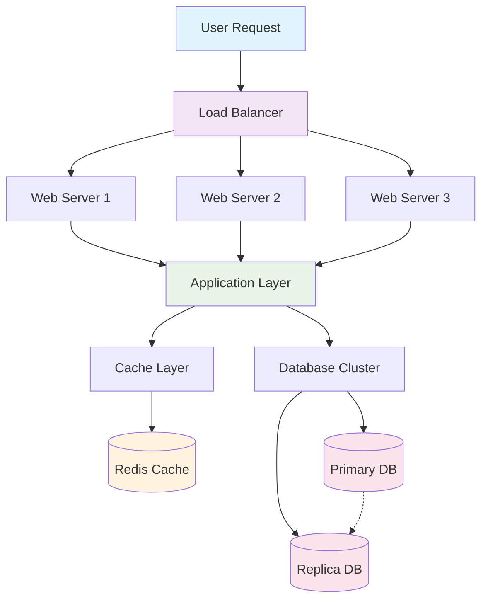
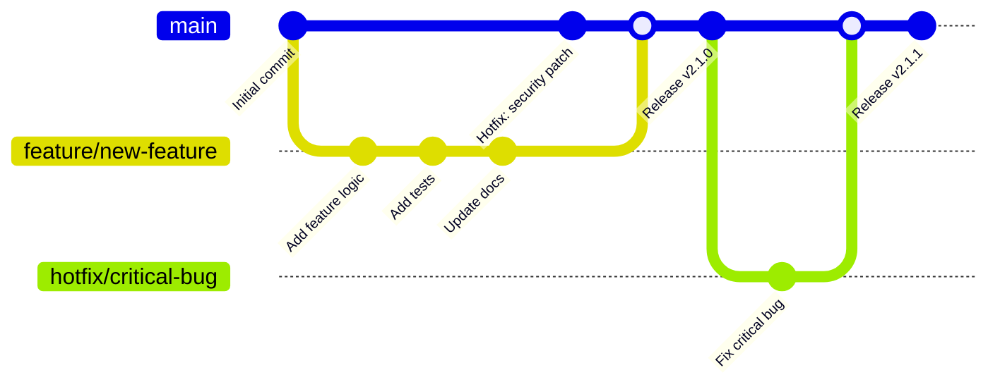
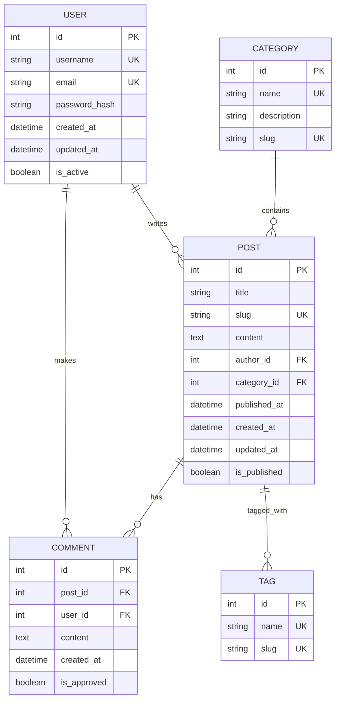

# Beautiful Code Syntax Highlighting

This post demonstrates the enhanced code styling and Mermaid diagram support in our techblog theme.

## Inline Code

You can use `inline code` like this, or reference functions like `console.log()` and keyboard shortcuts like <kbd>Ctrl</kbd> + <kbd>C</kbd>.

## JavaScript Example

```javascript
// Advanced JavaScript example with modern features
class DataProcessor {
    constructor(config) {
        this.config = { ...this.defaultConfig, ...config };
        this.cache = new Map();
    }

    async processData(data) {
        try {
            const result = await this.transformData(data);
            this.cache.set(data.id, result);
            return result;
        } catch (error) {
            console.error('Processing failed:', error);
            throw new Error(`Data processing failed: ${error.message}`);
        }
    }

    transformData = (data) => {
        return data.items
            .filter(item => item.active)
            .map(item => ({
                ...item,
                processed: true,
                timestamp: Date.now()
            }));
    }
}

// Usage example
const processor = new DataProcessor({
    timeout: 5000,
    retries: 3
});

const data = await processor.processData(inputData);
```

## Python Example

```python
# Python data analysis example
import pandas as pd
import numpy as np
from typing import List, Dict, Optional
from dataclasses import dataclass

@dataclass
class AnalysisResult:
    mean: float
    median: float
    std_dev: float
    outliers: List[float]

class DataAnalyzer:
    """Advanced data analysis with statistical computations."""

    def __init__(self, threshold: float = 2.0):
        self.threshold = threshold
        self.history: List[AnalysisResult] = []

    def analyze(self, data: List[float]) -> AnalysisResult:
        """Perform comprehensive data analysis."""
        array = np.array(data)

        # Calculate statistics
        mean = np.mean(array)
        median = np.median(array)
        std_dev = np.std(array)

        # Find outliers using z-score
        z_scores = np.abs((array - mean) / std_dev)
        outliers = array[z_scores > self.threshold].tolist()

        result = AnalysisResult(
            mean=mean,
            median=median,
            std_dev=std_dev,
            outliers=outliers
        )

        self.history.append(result)
        return result

# Example usage
analyzer = DataAnalyzer(threshold=2.5)
data = [1, 2, 3, 4, 5, 100, 6, 7, 8, 9]  # 100 is an outlier
result = analyzer.analyze(data)

print(f"Mean: {result.mean:.2f}")
print(f"Outliers detected: {result.outliers}")
```

## CSS Example

```css
/* Modern CSS with custom properties and grid */
:root {
    --primary-color: #3b82f6;
    --secondary-color: #1e293b;
    --border-radius: 0.75rem;
    --transition: all 0.3s cubic-bezier(0.4, 0, 0.2, 1);
}

.card {
    background: linear-gradient(135deg, #667eea 0%, #764ba2 100%);
    border-radius: var(--border-radius);
    padding: 2rem;
    box-shadow: 0 20px 25px -5px rgba(0, 0, 0, 0.1);
    transition: var(--transition);
    position: relative;
    overflow: hidden;
}

.card::before {
    content: '';
    position: absolute;
    top: 0;
    left: 0;
    right: 0;
    height: 4px;
    background: var(--primary-color);
    transform: scaleX(0);
    transition: transform 0.3s ease;
}

.card:hover::before {
    transform: scaleX(1);
}

.card:hover {
    transform: translateY(-4px);
    box-shadow: 0 25px 50px -12px rgba(0, 0, 0, 0.25);
}

/* Responsive grid layout */
.grid {
    display: grid;
    grid-template-columns: repeat(auto-fit, minmax(300px, 1fr));
    gap: 2rem;
    margin: 2rem 0;
}

@media (prefers-reduced-motion: reduce) {
    .card {
        transition: none;
    }
}
```

## Bash/Shell Example

```bash
#!/bin/bash

# Advanced deployment script with error handling
set -euo pipefail

readonly SCRIPT_DIR="$(cd "$(dirname "${BASH_SOURCE[0]}")" && pwd)"
readonly PROJECT_ROOT="$(dirname "$SCRIPT_DIR")"
readonly LOG_FILE="/tmp/deploy-$(date +%Y%m%d-%H%M%S).log"

# Colors for output
readonly RED='\033[0;31m'
readonly GREEN='\033[0;32m'
readonly YELLOW='\033[1;33m'
readonly NC='\033[0m' # No Color

log() {
    echo -e "${GREEN}[$(date +'%Y-%m-%d %H:%M:%S')]${NC} $*" | tee -a "$LOG_FILE"
}

error() {
    echo -e "${RED}[ERROR]${NC} $*" | tee -a "$LOG_FILE" >&2
}

warning() {
    echo -e "${YELLOW}[WARNING]${NC} $*" | tee -a "$LOG_FILE"
}

cleanup() {
    local exit_code=$?
    if [[ $exit_code -ne 0 ]]; then
        error "Deployment failed with exit code $exit_code"
        error "Check log file: $LOG_FILE"
    fi
    exit $exit_code
}

trap cleanup EXIT

deploy() {
    local environment=${1:-staging}
    local version=${2:-latest}

    log "Starting deployment to $environment (version: $version)"

    # Pre-deployment checks
    if ! command -v docker &> /dev/null; then
        error "Docker is not installed"
        return 1
    fi

    # Build and deploy
    log "Building application..."
    docker build -t "myapp:$version" "$PROJECT_ROOT" || {
        error "Build failed"
        return 1
    }

    log "Deploying to $environment..."
    docker-compose -f "docker-compose.$environment.yml" up -d || {
        error "Deployment failed"
        return 1
    }

    log "Deployment completed successfully!"
}

# Main execution
if [[ "${BASH_SOURCE[0]}" == "${0}" ]]; then
    deploy "$@"
fi
```

## JSON Configuration

```json
{
  "name": "techblog-theme",
  "version": "2.0.0",
  "description": "A beautiful, modern theme for technical blogs",
  "main": "index.js",
  "scripts": {
    "build": "npm run build:css && npm run build:js",
    "build:css": "tailwindcss -i ./src/styles.css -o ./dist/styles.css --minify",
    "build:js": "esbuild src/main.js --bundle --minify --outfile=dist/main.js",
    "dev": "concurrently \"npm run dev:css\" \"npm run dev:js\"",
    "dev:css": "tailwindcss -i ./src/styles.css -o ./dist/styles.css --watch",
    "dev:js": "esbuild src/main.js --bundle --watch --outfile=dist/main.js"
  },
  "dependencies": {
    "mermaid": "^10.6.1",
    "prismjs": "^1.29.0"
  },
  "devDependencies": {
    "tailwindcss": "^3.3.0",
    "esbuild": "^0.19.0",
    "concurrently": "^8.2.0"
  },
  "keywords": ["blog", "theme", "tailwind", "mermaid", "syntax-highlighting"],
  "author": "Tech Team",
  "license": "MIT"
}
```

## Mermaid Diagrams

### System Architecture



### Development Workflow



### Database Schema



## Special Elements

> **Important Note**: This is an enhanced blockquote that demonstrates the beautiful styling for important information, tips, and quotes.

You can also use ==highlighted text== and **bold text** for emphasis.

## Tables

| Feature | Basic Theme | TechBlog Theme | Description |
|---------|-------------|----------------|-------------|
| Syntax Highlighting | ❌ | ✅ | Advanced Prism.js integration |
| Mermaid Diagrams | ❌ | ✅ | Full diagram support |
| Copy to Clipboard | ❌ | ✅ | One-click code copying |
| Language Indicators | ❌ | ✅ | Visual language tags |
| Responsive Design | ⚠️ | ✅ | Mobile-first approach |
| Dark Mode | ❌ | 🔄 | Coming soon |

## Conclusion

This techblog theme provides a beautiful, modern experience for technical content with:

- **Enhanced code blocks** with syntax highlighting
- **Mermaid diagram support** for visualizations
- **Copy-to-clipboard functionality** for code snippets
- **Responsive typography** that looks great on all devices
- **Professional styling** that's easy on the eyes

Perfect for technical blogs, documentation, and tutorial sites!
