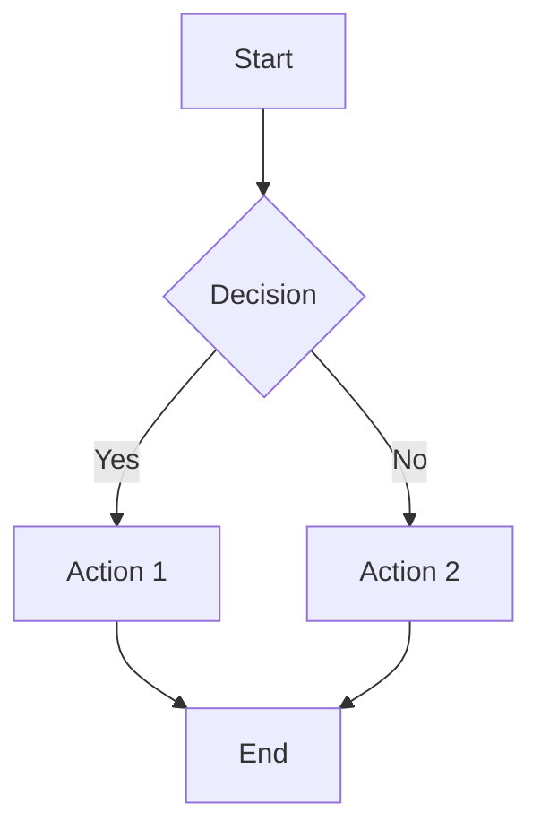

# TechBlog Theme

A beautiful, modern, and feature-rich theme for technical blogs built with Tailwind CSS.

## Features

### 🎨 Modern Design
- Clean, minimalist interface optimized for readability
- Professional typography with Inter and JetBrains Mono fonts
- Responsive design that works on all devices
- Subtle animations and hover effects

### 💻 Enhanced Code Support
- **Syntax Highlighting**: Powered by Prism.js with the Tomorrow Night theme
- **Language Indicators**: Visual tags showing the programming language
- **Copy to Clipboard**: One-click code copying functionality
- **Multiple Languages**: Support for JavaScript, Python, CSS, HTML, JSON, Bash, and more
- **Inline Code**: Beautiful styling for `inline code` snippets
- **Keyboard Shortcuts**: Styled <kbd>key</kbd> combinations

### 📊 Mermaid Diagrams
- **Full Mermaid Support**: Render diagrams directly from markdown
- **Multiple Diagram Types**: Flowcharts, Git graphs, ER diagrams, and more
- **Themed Styling**: Consistent with the overall design
- **Responsive**: Diagrams adapt to different screen sizes

### 🧭 Smart Navigation
- **Active Page Indicators**: Visual highlight of current page
- **Ordered Menu**: Automatic sorting by nav_order
- **Responsive Navigation**: Works perfectly on mobile devices
- **Smooth Animations**: Elegant transitions and hover effects

### 📱 SEO & Performance
- **Open Graph Tags**: Social media sharing optimization
- **Twitter Cards**: Enhanced Twitter link previews
- **Structured Data**: Proper semantic HTML
- **Fast Loading**: Optimized assets and minimal dependencies

## Usage

### Basic Setup

1. Set your site to use the techblog theme in `_config.yaml`:

```yaml
theme: "techblog"
title: "Your Tech Blog"
description: "Your blog description"
```

### Code Blocks

#### Syntax Highlighting

Create code blocks with language-specific syntax highlighting:

~~~markdown
```javascript
const greeting = (name) => {
    console.log(`Hello, ${name}!`);
};
```
~~~

#### Supported Languages

- JavaScript/TypeScript
- Python
- CSS/SCSS
- HTML
- JSON
- Bash/Shell
- And many more via Prism.js autoloader

### Mermaid Diagrams

Create diagrams using Mermaid syntax:

~~~markdown

~~~

### Page Configuration

Configure pages with front matter:

```yaml
---
title: "Your Post Title"
description: "Post description for SEO and navigation"
author: "Author Name"
date: "2025-10-23"
reading_time: 5
tags: ["javascript", "tutorial", "web-development"]
published: true
nav_order: 1
in_nav: true
---
```

### Special Elements

#### Inline Code
Use backticks for `inline code` highlighting.

#### Keyboard Shortcuts
Use `<kbd>` tags for <kbd>Ctrl</kbd> + <kbd>C</kbd> keyboard shortcuts.

#### Blockquotes
> Important information and quotes are beautifully styled with enhanced blockquotes.

#### Tables
Create responsive, styled tables:

| Feature | Status | Description |
|---------|---------|-------------|
| Syntax Highlighting | ✅ | Prism.js integration |
| Mermaid Diagrams | ✅ | Full diagram support |
| Copy Code | ✅ | One-click copying |

## Customization

### Theme Colors

The theme uses a custom color palette defined in the Tailwind config:

```javascript
'tech': {
    50: '#f8fafc',   // Very light gray
    100: '#f1f5f9',  // Light gray
    200: '#e2e8f0',  // Border gray
    300: '#cbd5e1',  // Medium gray
    400: '#94a3b8',  // Text gray
    500: '#64748b',  // Default gray
    600: '#475569',  // Dark gray
    700: '#334155',  // Darker gray
    800: '#1e293b',  // Very dark gray
    900: '#0f172a',  // Almost black
}
```

### Custom Styles

You can override styles by adding custom CSS to your theme:

```css
/* Custom code block styling */
.prose pre {
    border-left: 4px solid #3b82f6;
}

/* Custom blockquote styling */
.prose blockquote {
    background: linear-gradient(135deg, #667eea 0%, #764ba2 100%);
    color: white;
}
```

## Dependencies

### CSS Framework
- **Tailwind CSS**: Utility-first CSS framework via CDN

### Fonts
- **Inter**: Modern sans-serif font for body text
- **JetBrains Mono**: Monospace font for code

### JavaScript Libraries
- **Prism.js**: Syntax highlighting
- **Mermaid**: Diagram rendering

### Prism.js Plugins
- **Autoloader**: Automatic language detection
- **Normalize Whitespace**: Clean code formatting
- **Copy to Clipboard**: Code copying functionality

## Browser Support

- Chrome/Chromium 80+
- Firefox 75+
- Safari 13+
- Edge 80+

## Performance

- **Minimal JavaScript**: Only essential libraries loaded
- **CDN Assets**: Fast loading from global CDNs
- **Optimized CSS**: Utility-first approach reduces bundle size
- **Lazy Loading**: Mermaid diagrams render on demand

## Contributing

To improve the theme:

1. Test changes with the sample blog post: `2025-10-23-code-showcase.md`
2. Ensure responsiveness across devices
3. Verify syntax highlighting works for all supported languages
4. Test Mermaid diagram rendering
5. Check accessibility with screen readers

## License

MIT License - Feel free to use and modify for your projects.
